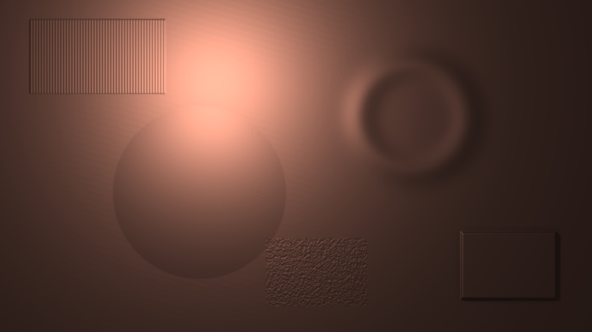
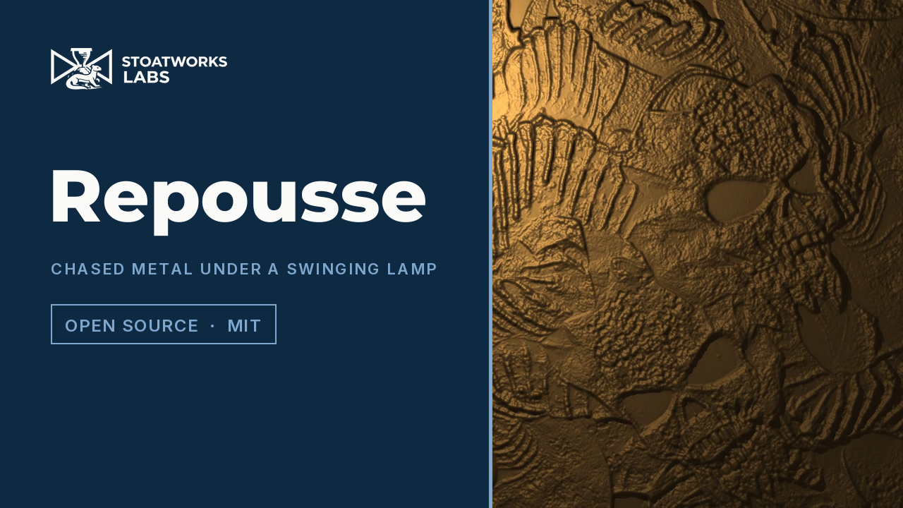

# repousse

> **AI-assisted project.** This codebase was created with [Claude](https://claude.com/claude-code)
> (Anthropic), directed and reviewed by a human author. The physics is not asserted but
> measured: an offline harness drives the real plugin class in a headless GL context and
> reads each claim back out of the picture — planes of known slope under a grid of lamps
> read the lamp's inverse-square Lambert law to a tolerance derived from one float ulp;
> the highlight on a hemisphere lands on the exact pixel the half-vector point predicts;
> each metal reflects its tabulated F0 at normal incidence; the shadow behind a step is
> h / tan θ within one march step; a ridge narrower than the punch comes out exactly the
> height the opening predicts and a wider one keeps its height; the lamp's period, read
> from its position in the picture over six seconds, is 2π√(L/g) with the large-angle
> correction to 4 parts in 10⁵, and its decay matches the stated Q — with seventeen
> negative controls that prove each check can fail, and one mutation of the shipped GLSL
> that two of them catch. It has **never been loaded into Resolume on macOS**; on
> Windows it has run in Resolume Arena 7.27.1, on software rendering. See
> [Status](#status).

The picture hammered into a metal sheet and lit by a lamp on a swinging cord — an FFGL
effect for [Resolume](https://resolume.com) Arena and Avenue.



<sub>One frame, rendered by `rptest`, the offline harness — not captured from Resolume.
The defaults, on the harness's moving relief card, a quarter of a second after
a kick.</sub>

<!-- downloads:start -->

## Download

**[v0.1.0](https://github.com/stoatworks-labs/repousse/releases/tag/v0.1.0)** — prebuilt for macOS and Windows. Pick your platform:

<details>
<summary><b>macOS</b> — Universal (Apple Silicon + Intel)</summary>

| Build | Download | Size |
| --- | --- | --- |
| Universal (Apple Silicon + Intel) · .dmg disk image | [`repousse-0.1.0-macos-universal.dmg`](https://github.com/stoatworks-labs/repousse/releases/download/v0.1.0/repousse-0.1.0-macos-universal.dmg) | 209 KB |
| Universal (Apple Silicon + Intel) · .zip archive | [`repousse-macos-universal.zip`](https://github.com/stoatworks-labs/repousse/releases/latest/download/repousse-macos-universal.zip) | 171 KB |

</details>

<details>
<summary><b>Windows</b> — x64</summary>

| Build | Download | Size |
| --- | --- | --- |
| x64 · .exe installer | [`repousse-0.1.0-windows-x86_64-setup.exe`](https://github.com/stoatworks-labs/repousse/releases/download/v0.1.0/repousse-0.1.0-windows-x86_64-setup.exe) | 219 KB |
| x64 · .zip archive | [`repousse-windows-x86_64.zip`](https://github.com/stoatworks-labs/repousse/releases/latest/download/repousse-windows-x86_64.zip) | 111 KB |

</details>

All builds, checksums and release notes: [github.com/stoatworks-labs/repousse/releases](https://github.com/stoatworks-labs/repousse/releases).

macOS builds are signed and notarised and open normally. The Windows builds are unsigned, so SmartScreen warns once.

<!-- downloads:end -->

[](https://www.youtube.com/watch?v=qEwOv_7uCkI)

*[Watch it](https://www.youtube.com/watch?v=qEwOv_7uCkI) — 55 seconds:
the sheet at the defaults with the lamp kicked into a swing, the punch at 4, 16 and 1 px, the
lamp lowered into raking light and Depth doubled, the five metals, Roughness tightening the
sheen and Patina darkening the recesses, a painted sheet on a 2 m cord, Show Height and Mix
back to the clip. Every frame is the real plugin's output: an FFGL plugin has no window, so
the footage is rendered by this repository's own offline harness (`rptest --pipe`, driven by a
cue sheet) rather than filmed off a screen, and the clips are Resolume's bundled demo media,
flattened onto black before the plugin (that take is v0.1.0's, and the one line v0.1.1 changed
is exactly the alpha that flattening removed).*

## The one idea

Repoussé is a sheet of metal worked from behind with punches. Two physical facts make
the look, and both are in the model rather than in a filter:

1. **The punch sets the finest detail.** A sheet can be pushed only as sharply as the
   tool that pushes it. The brightness is read as height, then opened and closed by the
   punch's profile. Detail narrower than the punch is not blurred away; it is never
   formed.
2. **Metal is lit, not shaded.** A point lamp at a real position with inverse-square
   falloff, a microfacet highlight (GGX, height-correlated Smith, Schlick Fresnel) with
   the reflectance of copper, brass, silver, gold or steel computed from published
   refractive indices (`tools/f0.py`), a small diffuse
   term for the patina, and self-shadowing by a march over the same height field.

The lamp hangs on a cord. It is a damped pendulum with the period its length gives it,
and an onset in the audio — or the Kick button — gives it a push. That is the only
audio coupling there is.

## What falls out

None of these is drawn on purpose:

- **Raking light.** Lower the lamp and every ridge throws a long shadow; the relief
  reads far deeper than its sixteen pixels.
- **Highlights slide across the relief as the lamp swings**, on the mirror points the
  microfacet model puts them at, and the pool of light under the lamp moves with it.
- **Worn metal.** Roughness spreads the highlight into a sheen; Patina darkens the
  recesses, because the recesses are where the horizon is high.
- **Punch size is style.** A big punch gives soft chased work; a fine one gives crisp
  engraving. A ridge narrower than the punch is lowered to d²/2R, whatever its height.
- **The swing is the music's.** A hard hit swings the lamp further and — as a real
  pendulum does — a little slower; a run of hits swings it in a rosette.

### The honest limit

The relief is the picture's brightness. A bright shirt is a bump whether or not it is
in front of anything, and a dark frame is a flat sheet with a lamp on it. The punch is
a rounded tip on a square shank, not a ball on a round one: on ridges and edges it is
the sphere to within the profile error stated in `AGENTS.md`, on an isolated dot it is
a little squarer. And the lamp has never met Resolume's FFT: what its 64 bins carry is
unmeasured, so the detector listens to the lowest eight of them and assumes nothing
about their law.

## Controls

| Group | |
| --- | --- |
| **Sheet** | Depth (the height of a white pixel, 0–64 px), Invert, Punch Radius (0–16 px), Smooth (σ 0–3 px, against 8-bit terraces), Metal (Copper, Brass, Silver, Gold, Steel), Roughness, Patina, Colour (Metal: the metal's own colour; Clip: the clip as a painted sheet). |
| **Lamp** | Lamp X, Lamp Y (fractions of the frame), Lamp Height (0–2 frame heights), Intensity (0–2; 1 is a white sheet directly under the lamp), Ambient, Shadows. |
| **Pendulum** | Cord Length (0.05–2 m; 1 frame height is 1 m, so the period is 0.45–2.8 s), Damping (ζ; Q = 1/2ζ), Swing (how hard a kick pushes), Kick (a button), Audio (the FFT input). |
| **Output** | Mix (over the clip), Show Height (the worked relief as grey, for setting the punch). |

With no audio routed the lamp hangs still. The onset detector is primed on the first
frame and after every jump in the clock, so triggering a clip with the music already
playing does not kick the lamp.

## Status

**v0.1.1, and honestly early — 24 September 2026.** (v0.1.0 the same day; v0.1.1 makes the
sheet opaque, where v0.1.0 kept the clip's alpha and cut the sheet to a transparent clip's silhouette.)

### Measured offline, on macOS

`tools/verify.sh` passes on this machine (M4 Max, macOS 26.4) against a fresh
universal Release build, running every rendered check at **two rasters**, 320×180 and
1280×720. What it establishes:

| check | result |
| --- | --- |
| `--lambert` | five planes (flat, three slopes, one through Smooth at σ 2 px) under five lamps each read `Intensity (Lref/r)² n·l kd F0` at every pixel and channel — worst error 1.8e-7 against a derived tolerance of 4.6e-6 |
| `--specular` | on a 64 px hemisphere the highlight's brightest pixel is **exactly** the pixel holding the half-vector point (three whole-pixel cases); three fractional cases land within 0.36–0.50 px against the lattice's half pixel plus a derived 0.083 px shift |
| `--fresnel` | copper, brass, silver, gold and steel, at α 0.5 and 0.25, reflect their tabulated F0 per channel to 5e-8 (tolerance 32 ulps) |
| `--shadow` | four steps (8–32 px) under four lamps (32°–80°) cast shadows whose end is `h (xe − Lx) / (Lz − h)` on three rows, within one march step and half a pixel: worst 0.30 of 0.60 px at 1280×720, 2.03 of 2.06 px at 320×180 |
| `--punch` | eleven ridges and eleven squares, 1–15 px wide, come out **exactly** `min(H, d²/2R)` tall under the punch and exactly H beyond it; three grooves match the stated 1-D open-close in double, all to 0.0e+00 |
| `--pendulum` | the lamp's position read from the picture over 360 frames: three full cycles within **3.9e-5** of 2π√(L/g) × (1 + θ²/16 + 11θ⁴/3072 + …) / √(1−ζ²) at θ₀ = 0.65 rad (a 2.7% correction); the log decrement within 1.2e-3 of 2πζ/√(1−ζ²) = 0.3146 (Q 10); y never moves |
| `--prime` | loud audio from frame 0 leaves the lamp at rest to 0.0000 px over 60 frames; a step at frame 30 kicks once, on that frame; a 5 s scrub back re-primes |
| `--resize` | a resize mid-run with the punch, patina and shadows on matches a fresh instance in every one of 4,157,044 values on this GPU (within 4 ulp on Apple's software renderer, which is not itself repeatable at the last bit); a swinging lamp follows an unresized run through it exactly |
| offline | nine control mappings and the metal table against this README; the paraboloid–sphere bound in closed form; the detector's priming, one kick per hit and its release; the pendulum model's period (3.4e-5) and decay; a six-day millisecond clock swings the lamp as a fresh one does (6e-11 m); names within 16 characters |
| `--negative` | seventeen perturbed models — no 1/r², no shadow march, the lobe on n·l, F0 grey, a flat punch, the punch 10% wide, sin θ → θ, g 3% high, ζ 15% high, an unprimed detector, stale buffers and a reset pendulum on resize, a float clock — each **fails** its check, at both rasters |
| mutation | one character of the shipped GLSL (the GGX denominator, `+ 1.0` → `+ 1.1`) was caught by `--fresnel` and `--specular`, then reverted |
| `tools/sweep.py` | all **20** controls measurably change the picture |
| shaders | all 5, as the plugin compiles them, through `glslc` |
| `--pipe` | 2.5 frames in, exactly 2 out; an unknown cue refused (2); a failed render and a closed stdout (`head -c 1`) each exit 1 |
| the bundle | universal (`x86_64 arm64`), exports `plugMain`, carries `RP01`, ad-hoc signs; `oxbow` reports `SW Repousse` / `RP01` / `effect` and renders 120 frames through `plugMain` |

Render cost at the defaults, best of three runs of 60 frames after a warm-up,
`glFinish` both sides, on a GPU shared with other work: **0.31 ms** at 720p,
**0.51 ms** at 1080p, **2.61 ms** at 4K. With the punch at its maximum (16 px, 33
taps an axis): **0.55 ms**, **1.21 ms**, **5.38 ms**. macOS figures only.

### Not established

It has **never been loaded into Resolume on macOS**. Everything above was compiled, rendered
and measured offline against the real plugin class in a headless CGL context, plus an
`oxbow` load. How it looks on real footage was checked on six of Resolume's bundled
demo clips through `--pipe` (the defaults do not flood dark clips; a dark frame is a
flat sheet with the lamp's pool on it), not in Arena. How 21 controls read in the
inspector, what Resolume's FFT bins actually carry, and how the Kick event arrives are
untested. On Windows it has: a build of this source (the release workflow's DLL at 844d25d, whose `source/` is v0.1.0's) loads, registers and renders in Resolume Arena 7.27.1 on software rendering (win-lab, Mesa llvmpipe, no GPU, 2026-09-24), with all 27 host controls matching the declaration, and Arena's log stays clean: 8 of the fleet Arena gate's 9 checks. The ninth, controls, read Cord Length, Damping and Swing dead, because the gate holds a still picture and never presses Kick, and a pendulum nobody pushes hangs still whatever its cord, damping and swing; the harness's `--pendulum` and `--resize` checks measure all three from the picture. The Audio input was skipped: win-lab has no sound device. Software rendering says nothing about a GPU or about speed.
No OpenFX port and no presets. There is a [user guide](https://stoatworks-labs.com/software/repousse/guide/).
The [browser demo](https://repousse-demo.stoatworks-labs.com/)
runs the plugin's own five shaders, but its CPU half — every control's units, the
Runge-Kutta pendulum and the pass order — is a hand port to JavaScript that nothing
checks but a reader, and no audio reaches it: only its Kick button swings the lamp.

## Build

Needs CMake 3.15+, a C++17 compiler, and the FFGL SDK submodule.

```bash
git clone --recursive https://github.com/stoatworks-labs/repousse
cd repousse
cmake -B build -DCMAKE_BUILD_TYPE=Release
cmake --build build --parallel
cmake --install build     # into ~/Documents/Resolume Arena/Extra Effects
```

macOS builds are universal (Apple Silicon + Intel) by default; add
`-DCMAKE_OSX_ARCHITECTURES=arm64` for a faster dev build. Windows needs GLEW via vcpkg.

## Building and testing

The offline harness renders the real plugin class headlessly:

```bash
./build/rptest --out /tmp/frame.png --size 1920x1080   # the moving relief card
./build/rptest --list                                  # every control, kind and default
./build/rptest --lambert --specular --fresnel          # the lamp, measured
./build/rptest --shadow --punch --pendulum             # the relief and the swing
./build/rptest --prime --resize
./build/rptest --negative                              # and the checks can fail
./build/rptest --offline                               # what needs no GL (CI)
./build/rptest --bench                                 # 720p, 1080p and 4K
python3 tools/sweep.py                                 # no control is silently dead
python3 demo/tools/check_shaders.py                    # the browser demo's shaders are the plugin's
tools/verify.sh                                        # all of it, on a fresh universal build
```

Every check takes `--size`; run it at 320×180 as well as the raster you care about.
Footage goes through the real shaders with `--pipe`, in the fleet's frame format:

```bash
ffmpeg -i in.mov -f rawvideo -pix_fmt rgba - \
  | ./build/rptest --pipe --size 1920x1080 --script cues.txt \
  | ffmpeg -f rawvideo -pix_fmt rgba -s 1920x1080 -r 60 -i - out.mov
```

See [`CLAUDE.md`](CLAUDE.md) for the full command reference and
[`AGENTS.md`](AGENTS.md) for the model and the traps.

<!-- attributions:start -->
This project is built on other people's work — see [ATTRIBUTIONS.md](ATTRIBUTIONS.md).
<!-- attributions:end -->

## Licence

MIT — see [LICENSE](LICENSE).
